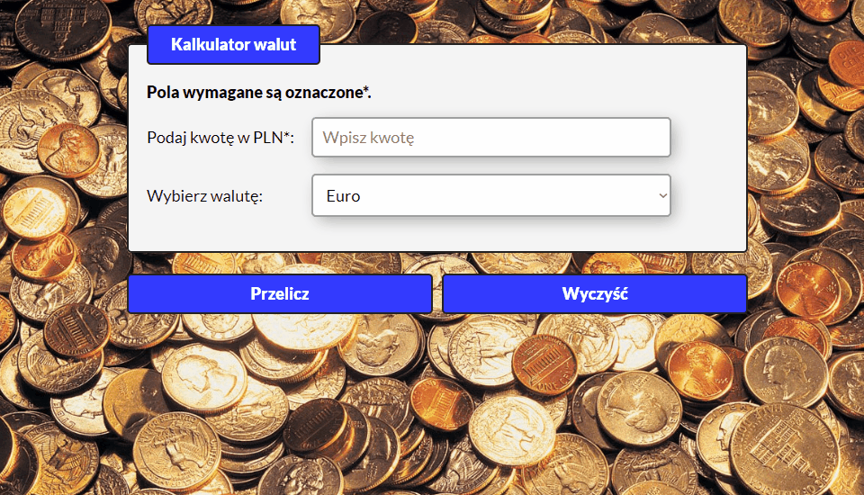

# Currency-converter

## Demo

https://wroblewski82.github.io/currency-converter/

## Description

The currency calculator is another project that aims to show my basic knowledge in HTML, CSS, JS. When writing the code,
I put special emphasis on the use of accepted conventions and good practices.

The correctness of my work is supervised by [Krzysztof Dąbrowski](https://www.linkedin.com/in/dabrowskisoftware) - an experienced Senior Software Engineer.

## Technologies

- BEM
- Flexbox
- ES6+ Features

## Instruction

Enter the amount you want to convert from PLN to another currency. Choose from four foreign currencies.
Click the "Przelicz" button and you will get the results at the bottom of the application.
If you want to clear all fields, click the "Wyczyść" button.
